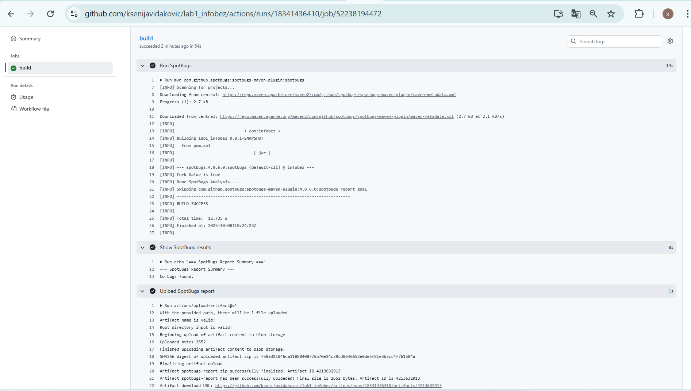
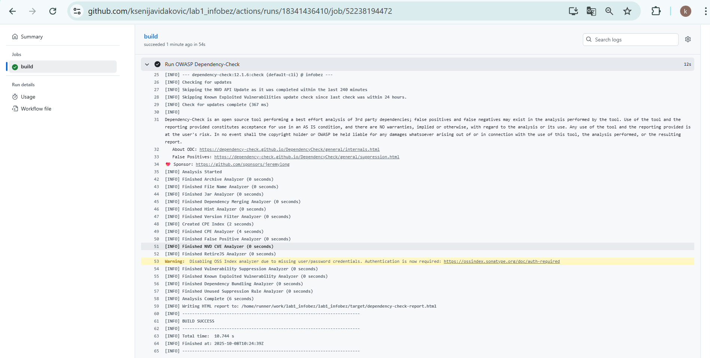
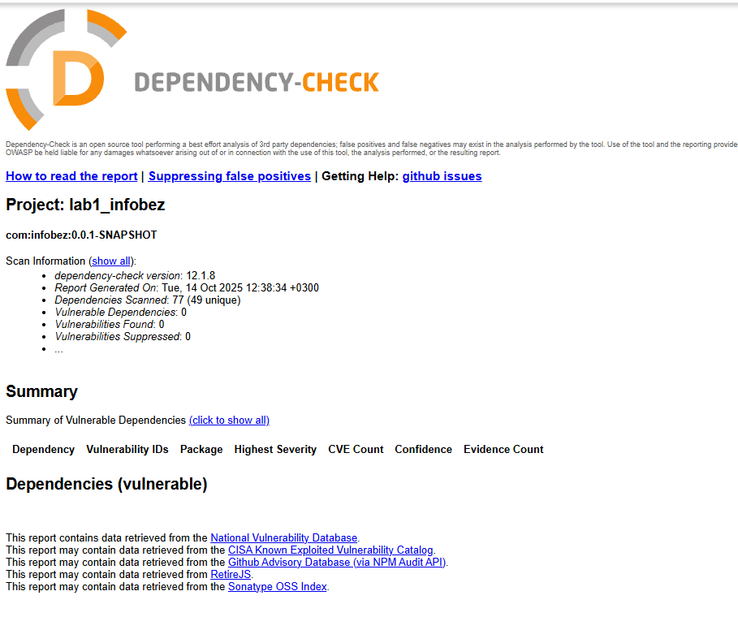

# Lab1 Infobez

Лабораторная работа по информационной безопасности.  
Реализовано простое REST API на **Spring Boot** с базовыми мерами защиты: аутентификация через JWT, защита от SQL-инъекций и XSS.

---

## API эндпоинты

###  Аутентификация
- **POST** `/auth/register`  
  Регистрация нового пользователя.  
  **Параметры (JSON):**
  ```json
  {
    "username": "testuser",
    "password": "mypassword"
  }
  
  
  Ответ:
  { "message": "registered" }


- **POST** /auth/login
Логин пользователя. Возвращает JWT токен.
Параметры (JSON):
  ```json
  {
  "username": "testuser",
  "password": "mypassword"
  }

  Ответ:
  {
  "type": "Bearer",
  "token": "eyJhbGciOiJIUzI1NiJ9..."
  }

###  Работа с данными

- ** GET** /api/data
Получение списка данных (только для аутентифицированных пользователей).
Пример ответа:
   ```json
  [
   {
        "owner": "testuser",
        "id": 1,
        "title": "Hello"
    },
    {
        "owner": "testuser",
        "id": 2,
        "title": "World"
    }
  ]


### Реализованные меры безопасности
### Защита от SQL-инъекций


Используется Spring Data JPA (Hibernate), который генерирует SQL-запросы автоматически.

Все запросы выполняются через ORM и PreparedStatement, что исключает возможность подставить произвольный SQL-код.

Конкатенация строк в запросах полностью отсутствует.

Пользовательские данные никогда напрямую не вставляются в SQL.


###  Защита от XSS

Все строки, введённые пользователями, проходят экранирование с помощью HtmlUtils.htmlEscape().

При регистрации имя пользователя очищается.

В API-ответах (/api/data, /api/echo) все поля также экранируются.

JSON-ответы сериализуются через Jackson, что предотвращает инъекции HTML/JS-кода.


###  Защита от "Broken Authentication"

Реализована аутентификация на основе JWT-токенов:

При успешном входе (/auth/login) сервер генерирует JWT с подписью (алгоритм HS256) и сроком действия (expirationMinutes).

Каждый запрос к защищённым эндпоинтам проходит через фильтр JwtAuthFilter, который:

Проверяет подпись токена.

Извлекает username и role.

Добавляет данные в SecurityContextHolder.

Пароли пользователей никогда не хранятся в базе в открытом виде:

Используется BCryptPasswordEncoder(12) — устойчивый к перебору и rainbow tables алгоритм.

При неправильных учётных данных возвращается корректный HTTP-статус 401 Unauthorized.

Доступ к приватным эндпоинтам (/api/**) разрешён только аутентифицированным пользователям.

### Защита от CSRF

CSRF-защита отключена (http.csrf().disable()), так как API предполагается использовать с JWT-токенами в Authorization Header.

Это соответствует best-practice для REST API: защита основана не на cookie-сессиях, а на токенах.

###  Скриншоты CI/CD

###  Отчёт SAST (SpotBugs)


###  Отчёт SCA (Dependency-Check)




###  Автор

Ксения Виданович P3415